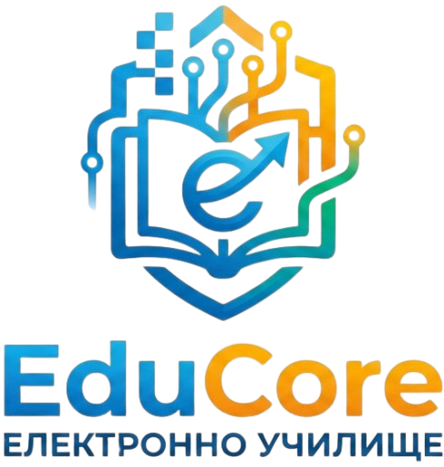

# EduCore — Електронно Училище


**EduCore** is a desktop educational application built with C++ and raylib. It provides students with structured learning materials, practice exercises, and timed tests — with results tracked in a built-in gradebook.

---

## Features

- **Materials & Lessons** — Browse structured lessons covering Algebra, Geometry, and Fractions & Percentages, with tab navigation between topics.
- **Exercises** — Practice problems with typed answers, hints, and instant feedback. Progress is tracked with visual dots.
- **Timed Tests** — 10 multiple-choice questions with a 30-second timer per question. Correct answers are highlighted in green, wrong ones in red.
- **Gradebook** — All test results are saved and displayed in a table with your score, percentage, numeric grade (2–6 scale), and date. An overall average is calculated automatically.
- **Grade Scale** — Grades are calculated using the formula: `grade = percentage × 0.06`, clamped between **2.00** and **6.00**.

---

## Requirements

| Tool | Version |
|------|---------|
| Visual Studio | 2022 (or later) |
| C++ Standard | C++11 or later |
| raylib | via NuGet |

---

## Getting Started

### 1. Clone the repository
```bash
git clone https://github.com/AIIvanov24/EduCore.git
cd educore
```

### 2. Open in Visual Studio

Open `main.slnx` (or `main.sln`) in Visual Studio.

### 3. Restore NuGet packages

Visual Studio should restore raylib automatically via NuGet on first build. If it doesn't:

- Right-click the solution in Solution Explorer
- Select **Restore NuGet Packages**

### 4. Build and run

Press **F5** or click **Run** to build and launch the app.

---

## How to Use

### Home Page
- Click the **MATHS** card to enter the Mathematics section.
- Click **GRADEBOOK** to view your past test results.
- The **Exit** button (top-right, red) closes the application from any page.

### Maths Page
Choose one of three sections:
- **Materials & Lessons** — Read through the lesson content. Use the tab buttons to switch topics and the Prev/Next buttons to navigate.
- **HW & Practice** — Type your answer into the input box and press **Check Answer**. A hint is provided for each question.
- **Tests** — Answer 10 multiple choice questions. You have 30 seconds per question. Your grade is saved to the Gradebook automatically when you finish.

### Gradebook
Displays all completed tests with:
- Score (e.g. `7 / 10`)
- Percentage (e.g. `70%`)
- Numeric grade on the 2–6 scale (e.g. `4.20`)
- Date of the test

---

## Grade Scale

| Percentage | Grade |
|-----------|-------|
| 100% | 6.00 |
| 83% | 4.98 |
| 67% | 4.02 |
| 50% | 3.00 |
| 33% | 1.98 → clamped to **2.00** |
| 0% | 0.00 → clamped to **2.00** |

Formula: `grade = percentage × 0.06` (min: 2.00, max: 6.00)

---

## Team

| Name | Role |
|------|------|
| [AIIvanov24](https://github.com/AIIvanov24) | Scrum Trainer |
| [IGLapchev24](https://github.com/IGLapchev24) | Backend Developer |
| [ZDKostov24](https://github.com/ZDKostov24) | Backend Developer |
| [SSDimitrov24](https://github.com/SSDimitrov24) | Quality Engineer |

---

## Resources

| Resource | Link |
|----------|------|
| 📊 Presentation | [View on SharePoint](https://codingburgas-my.sharepoint.com/:p:/g/personal/aiivanov24_codingburgas_bg/IQAPOQt-81llS7dA6v7Aqa4PAVzjnXyUhpTw9a-0DAZdcaY?e=f17rI5) |
| 📄 Documentation | [View on SharePoint](https://codingburgas-my.sharepoint.com/:p:/g/personal/aiivanov24_codingburgas_bg/IQAPOQt-81llS7dA6v7Aqa4PAVzjnXyUhpTw9a-0DAZdcaY?e=f17rI5)|

---

## Built With

- [raylib](https://www.raylib.com/) — Simple and easy-to-use game/graphics library for C/C++
- C++11
- Visual Studio 2022

